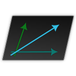

CoordinateOffset
================
**A Minecraft Spigot/Paper plugin that configurably obfuscates players' coordinates.**



[Spigot](https://www.spigotmc.org/resources/coordinateoffset.111292/) |
[Modrinth](https://modrinth.com/plugin/coordinateoffset) |
[Hangar](https://hangar.papermc.io/jtchips/CoordinateOffset) |
[CurseForge](https://legacy.curseforge.com/minecraft/bukkit-plugins/coordinateoffset) |
[bStats](https://bstats.org/plugin/bukkit/CoordinateOffset/19988)

Minecraft offers a useful "debug" (F3) menu that allows anyone to easily see their precise coordinates in the world.
This makes it easy to save points of interest and share locations with friends (or enemies).

However, not all multiplayer servers want coordinates to be so easily accessible. `/gamerule reducedDebugInfo` can
administratively hide coordinates from the F3 menu, but it is trivial for a player to add a client-side mod that
shows them.

**CoordinateOffset** is a plugin for Spigot and Paper servers that **applies an offset to every coordinate in packets
between the server and client**. The player still sees the exact same world they would normally see. But no matter which
mods they install, it is impossible for them to know their real coordinates.

Features
--------
* Fully-configurable, flexible methods of determining how to apply offsets
* Randomize offset when the player joins, dies, changes world, or teleports
* Match offsets to the player's position, so they see themselves near the world's origin
* Persist the same offset every time a player joins so that they don't notice an offset changing
* Configure different offsets per-player, per-world, and with permissions
* Extensible API to flexibly get and set offsets

Requirements and Installation
-----------------------------
* Spigot, [Paper (recommended)](https://papermc.io/), or a fork for Minecraft 1.19.4, 1.20, 1.20.1
* [ProtocolLib](https://github.com/dmulloy2/ProtocolLib/releases) **5.1.0** or higher
* An understanding of the [implications of installing this
plugin](https://github.com/joshuaprince/CoordinateOffset/wiki/Implications-and-Limitations).

After ensuring that you meet the requirements, just grab the latest
[release](https://github.com/joshuaprince/CoordinateOffset/releases/latest) and drop it in your server's `plugins`
folder.

Configuration
-------------
*Main article: [Configuration Guide](https://github.com/joshuaprince/CoordinateOffset/wiki/Configuration-Guide)*

The main configuration file is automatically generated after the first run at `plugins/CoordinateOffset/config.yml`.

```yaml
defaultOffsetProvider: random
```

The default configuration contains four predefined "offset providers". An "offset" refers to the amount that the
player's coordinates should appear to be shifted from their real location. Get started by picking a strategy that
matches the type of offsetting you're trying to achieve:
* `constant` - Specify the exact offset you want players to have.
* `disabled` - Players will see their real coordinates.
* `random` - Randomize each player's offset whenever they join the server.
* `zeroAtLocation` - Use an offset based on the player's starting location, so they see themselves near (0, 0).

You can customize these providers further, use different providers for different players/worlds/groups, and define your
own providers. See the complete
[**Configuration Guide**](https://github.com/joshuaprince/CoordinateOffset/wiki/Configuration-Guide).

Commands
--------
```
/offset [player]
```
Gets your own current offset and real coordinates, or someone else's.

```
/offsetreload
```
Reload the configuration from `config.yml`.

Permissions
-----------
* `coordinateoffset.bypass`
Players with this permission will never have their coordinates offsetted.
It's a good idea to give this permission to anyone who needs to use coordinates for commands or administration.

* `coordinateoffset.query`
Allows you to use the `/offset` command, which tells you your current offset.

* `coordinateoffset.query.others`
Allows you to query other players' offsets with `/offset <name>`.

* `coordinateoffset.reload`
  Allows you to reload the plugin config with `/offsetreload`.

API
---
You can use or extend CoordinateOffset in your own plugin by using the API. Please see the
[API Guide](https://github.com/joshuaprince/CoordinateOffset/wiki/API).

Credits
-------
Special thanks to [Cavallium](https://github.com/cavallium) for developing
[**CoordinatesObfuscator**](https://github.com/cavallium/CoordinatesObfuscator), which CoordinateOffset is a fork of.
CoordinateOffset uses most of the original code for packet translation.

Libraries used:
* [bStats](https://bstats.org/) ([Statistics for this plugin](https://bstats.org/plugin/bukkit/CoordinateOffset/19988))
* [ProtocolLib](https://github.com/dmulloy2/ProtocolLib)
* [CommandAPI](https://commandapi.jorel.dev/)
* [MorePersistentDataTypes](https://github.com/JEFF-Media-GbR/MorePersistentDataTypes)
