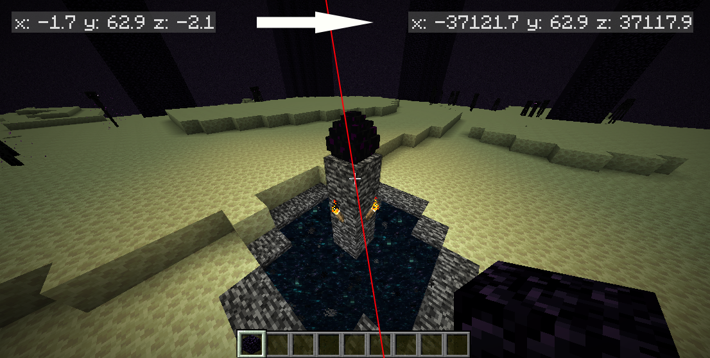

CoordinateOffset
================
**A Minecraft Spigot/Paper plugin that configurably obfuscates players' coordinates.**


[](https://github.com/joshuaprince/CoordinateOffset/releases)
[](https://discord.gg/V3xYtqU9JU)
[](https://ko-fi.com/jtprince)

[](https://bstats.org/plugin/bukkit/CoordinateOffset/19988)
[](https://bstats.org/plugin/bukkit/CoordinateOffset/19988)
[](https://modrinth.com/plugin/coordinateoffset)
[](https://www.spigotmc.org/resources/coordinateoffset.111292/)
[](https://hangar.papermc.io/jtchips/CoordinateOffset)
[](https://dev.bukkit.org/projects/coordinateoffset)

Minecraft offers a useful debug menu (F3) that allows anyone to easily see their coordinates in the world.
This makes it easy to save points of interest and share locations with friends (or enemies).

However, not all multiplayer servers want coordinates to be so easily accessible. `/gamerule reducedDebugInfo` can
administratively hide coordinates from the F3 menu, but it is trivial for a player to add a client-side mod that
shows them.

<p align="center">

</p>

**CoordinateOffset** is a plugin for Spigot and Paper servers that modifies every coordinate in packets between the
server and client. The player still sees the exact same world they would normally see. But no matter which mods they
install, they cannot see their real coordinates.

Why?
----
This plugin isn't intended for all servers. Here are a few ideas that might make CoordinateOffset useful:
* **Prevent metagaming**: If you consider coordinate usage and sharing to be metagaming, this prevents it.
* **Buff in-game items**: Compasses, lodestones, recovery compasses, and maps are no longer outclassed by coordinates 
  when those coordinates are inconsistent.
* **Prevent coordinate leaks**: If everyone sees different coordinates, players cannot derive each other's coordinates
  from an accidental leak in a screenshot.
* **Guard the world seed**: Any unknown offset makes seed-cracking tactics harder.
* **Center the origin**: Put the (0, 0) coordinate anywhere you'd like.

Features
--------
* Fully-configurable, flexible methods of determining how to apply offsets
* Randomize offset when the player joins, dies, or changes world
* Match offsets to the player's position, so they see themselves near the world's origin
* Persist the same offset every time a player joins so that they don't notice coordinates changing
* Configure different offsets per-player, per-world, and with permissions
* Extensible API to flexibly get and set offsets
* Compatible with ViaVersion, ViaBackwards, BungeeCord, Waterfall, and Velocity

Requirements and Installation
-----------------------------
* Spigot, [Paper (recommended)](https://papermc.io/), or a fork for Minecraft
  1.17.x, 1.18.x, 1.19.x, 1.20.x, 1.21, 1.21.1, 1.21.2, 1.21.3
* An understanding of the [implications of installing this
plugin](https://github.com/joshuaprince/CoordinateOffset/wiki/Implications-and-Limitations).

After ensuring that you meet the requirements, just grab the latest
[release](https://github.com/joshuaprince/CoordinateOffset/releases/latest) and drop it in your server's `plugins`
folder. Then follow steps below to configure how coordinates are affected for each player.

Configuration
-------------
*Main article: [Configuration Guide](https://github.com/joshuaprince/CoordinateOffset/wiki/Configuration-Guide)*

The main configuration file is automatically generated after the first run at `plugins/CoordinateOffset/config.yml`.

```yaml
defaultOffsetProvider: random
```

The default configuration contains four predefined "offset providers". An "offset" refers to the amount that the
player's coordinates should appear to be shifted from their real location. Get started by picking a strategy that
matches the type of offsetting you're trying to achieve:
* `constant` - Specify the exact offset you want players to have.
* `disabled` - Players will see their real coordinates.
* `random` - Individually randomize each player's offset every time they join the server.
* `zeroAtLocation` - Use an offset based on the player's starting location, so they see themselves near (0, 0).

You can customize these providers further, use different providers for different players/worlds/groups, and define your
own providers. See the complete
[**Configuration Guide**](https://github.com/joshuaprince/CoordinateOffset/wiki/Configuration-Guide).

Commands
--------
```
/offset [player]
```
Gets your or someone else's current offset and real coordinates.

```
/offsetreload
```
Reload the configuration from `config.yml`.

Permissions
-----------
* `coordinateoffset.bypass`
Players with this permission will never have their coordinates offsetted.
It's a good idea to give this permission to anyone who needs to use coordinates for commands or administration.

* `coordinateoffset.query`
Allows you to use the `/offset` command, which tells you your current offset.

* `coordinateoffset.query.others`
Allows you to query other players' offsets with `/offset <name>`.

* `coordinateoffset.reload`
Allows you to reload the plugin config with `/offsetreload`.

API
---
You can use or extend CoordinateOffset in your own plugin by using the API. Please see the
[API Guide](https://github.com/joshuaprince/CoordinateOffset/wiki/API).

Support
-------
* Open an [issue on GitHub](https://github.com/joshuaprince/CoordinateOffset/issues) to report a bug or request a feature.
* Join the [Chips's Mods](https://discord.gg/V3xYtqU9JU) Discord for help.

Credits
-------
Special thanks to [Cavallium](https://github.com/cavallium) for developing
[**CoordinatesObfuscator**](https://github.com/cavallium/CoordinatesObfuscator), which CoordinateOffset is a fork of.
CoordinateOffset's packet translation logic was heavily modeled after the work done by CoordinatesObfuscator.

Libraries used:
* [bStats](https://bstats.org/) ([Statistics for this plugin](https://bstats.org/plugin/bukkit/CoordinateOffset/19988))
* [PacketEvents](https://github.com/retrooper/packetevents)
* [MorePersistentDataTypes](https://github.com/JEFF-Media-GbR/MorePersistentDataTypes)
